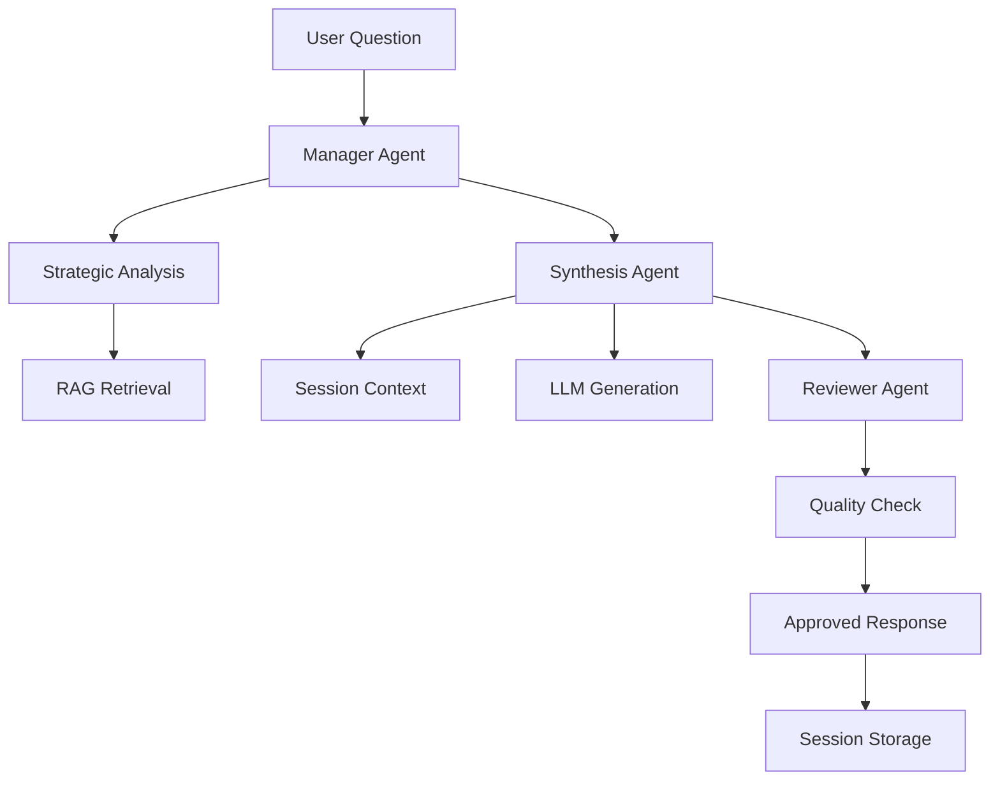

# AskImmigrate 2.0: Session-Aware Multi-Agent U.S. Immigration Assistant 🇺🇸🤖

**Navigate U.S. immigration with AI-powered guidance that remembers your conversation and provides contextual follow-up responses.**

---

## 🌟 New in Version 2.0

### **Session-Aware Conversations**
- **Remembers your questions** across multiple interactions
- **Contextual follow-ups** that build on previous discussion
- **Natural conversation flow** for complex immigration planning

### **Multi-Agent Intelligence**
- **Manager Agent**: Strategic analysis and workflow coordination
- **Synthesis Agent**: Contextual response generation with session awareness  
- **Reviewer Agent**: Quality control and validation
- **Session Management**: Persistent conversation memory

### **Smart Follow-up Detection**
- Understands references like "How do I extend **it**?" (referring to previous visa discussion)
- Handles session queries like "What was my first question?"
- Builds comprehensive immigration guidance over multiple turns

---

## 🚀 Quick Demo

```bash
# Start immigration consultation
$ python backend/code/cli.py --agent -q "What is an F-1 visa?" -s "my-consultation"
# Response: Detailed F-1 visa information...

# Natural follow-up - system remembers context
$ python backend/code/cli.py --agent -q "How do I extend it?" -s "my-consultation"  
# Response: F-1 extension procedures (knows "it" = F-1 visa)

# Session reference
$ python backend/code/cli.py --agent -q "What was my first question?" -s "my-consultation"
# Response: "Your first question was: 'What is an F-1 visa?'"

# Continue building on conversation
$ python backend/code/cli.py --agent -q "What about work authorization?" -s "my-consultation"
# Response: F-1 work authorization info, referencing previous F-1 discussion
```

---

## 🏗️ Architecture Overview

### **Multi-Agent Workflow**
```
User Question → Manager Agent → Synthesis Agent → Reviewer Agent → Response
                     ↓              ↓              ↓
              Strategic       Session-Aware    Quality
              Analysis        Response Gen.    Validation
                     ↓              ↓              ↓
               RAG Retrieval   Tool Integration  Approval
```

### **Session Management System**
- **Persistent Storage**: SQLite database for conversation history
- **Context Building**: Automatic session context from previous turns
- **Follow-up Detection**: ML-based detection of referential questions
- **Session Continuity**: Maintains context across CLI sessions

---

## 📋 Features

### **🧠 Intelligent Session Awareness**
- **Conversation Memory**: Remembers all previous questions and answers
- **Context Building**: Automatically references relevant previous discussion
- **Follow-up Understanding**: Handles pronouns and implicit references
- **Topic Tracking**: Maintains awareness of visa types and topics discussed

### **📚 Comprehensive Immigration Knowledge**
- **Official Sources**: Based on USCIS forms, policies, and procedures
- **Current Information**: Real-time web search for latest requirements
- **Fee Calculations**: Integrated fee calculator for various visa types
- **Form Guidance**: Specific form numbers and procedural steps

### **🔧 Advanced Tool Integration**
- **RAG Retrieval**: Vector-based document search through immigration knowledge base
- **Web Search**: Current information from official sources
- **Fee Calculator**: Dynamic fee computation for immigration applications
- **Session Context**: Intelligent use of conversation history

### **💬 Natural Conversation Interface**
- **CLI**: Command-line interface with session management
- **Web UI**: Browser-based interface (via FastAPI backend)
- **Session Persistence**: Conversations saved across interactions
- **Multiple Sessions**: Manage different immigration topics separately

---

## 🚀 Quick Start

### Prerequisites
- **Python**: 3.10+ (tested with 3.11)
- **Node.js**: >=18.0.0 and <21.0.0 (for React frontend, optional)
- **API Keys**: GROQ (recommended) or OpenAI + Tavily (required)

### Installation
```bash
git clone https://github.com/okumujustine/AskImmigrate2.0.git
cd AskImmigrate2.0

# Install Python dependencies
pip install -r requirements.txt

# Initialize vector database (one-time setup)
python -m backend.code.embed_documents

# Install frontend dependencies (optional - for web UI)
cd frontend
npm install
cd ..
```

### Environment Setup
Create `.env` file in the repository root directory:
```bash
# Choose one LLM provider (REQUIRED):
GROQ_API_KEY=your-groq-api-key          # Recommended: Fast + Free tier
# Alternative: OPENAI_API_KEY=your-openai-api-key      # Requires billing

# Web search functionality (REQUIRED)
TAVILY_API_KEY=your-tavily-api-key      # Get from: https://tavily.com

# Optional: Enable advanced tracing and monitoring
LANGSMITH_TRACING=true
LANGSMITH_ENDPOINT="https://api.smith.langchain.com"
LANGSMITH_API_KEY=your-langsmith-key
LANGSMITH_PROJECT="AskImmigrate2.0"
```

### Quick Test
```bash
# Test CLI without API key (uses mock data)
python backend/code/cli.py --test -q "what is f1?"

# Use session-aware multi-agent workflow (requires API keys)
python backend/code/cli.py --agent -q "What is an F-1 visa?" -s "my-session"

# Alternative: Use convenience script
./run_cli.sh --agent -q "What is an F-1 visa?" -s "my-session"
```

---

## 🎯 Usage Examples

### **📖 Immigration Consultation**
```bash
# Start comprehensive consultation
python backend/code/cli.py --agent -q "I'm on F-1, want to apply for OPT" -s "opt-planning"
python backend/code/cli.py --agent -q "What documents do I need?" -s "opt-planning"
python backend/code/cli.py --agent -q "How long does it take?" -s "opt-planning"  
python backend/code/cli.py --agent -q "What are the fees?" -s "opt-planning"
```

### **👨‍👩‍👧‍👦 Family Immigration Planning**
```bash
# Plan for spouse and children
python backend/code/cli.py --agent -q "Can I bring my family on H-1B?" -s "family-h1b"
python backend/code/cli.py --agent -q "Can my spouse work?" -s "family-h1b"
python backend/code/cli.py --agent -q "What about my children's education?" -s "family-h1b"
```

### **🔄 Status Change Planning**
```bash
# Plan F-1 to H-1B transition
python backend/code/cli.py --agent -q "How do I change from F-1 to H-1B?" -s "f1-to-h1b"
python backend/code/cli.py --agent -q "When should I apply?" -s "f1-to-h1b"
python backend/code/cli.py --agent -q "What if my application is denied?" -s "f1-to-h1b"
```

### **💾 Session Management**
```bash
# List all your immigration conversations
python backend/code/cli.py --agent --list-sessions

# Example output:
# 📝 Agentic Workflow Sessions:
#   • opt-planning: 4 turns, last active 2025-01-13T10:30:45
#   • family-h1b: 6 turns, last active 2025-01-13T09:15:22
#   • f1-to-h1b: 3 turns, last active 2025-01-12T16:45:10
```

---

## 🌐 Web Interface

### Start Backend Server
```bash
uvicorn backend.code.api:app --host 0.0.0.0 --port 8088
```
*Backend will be available at: http://localhost:8088*

### Start Frontend (Optional)
```bash
cd frontend
npm install
npm run dev
```
*Frontend will be available at: http://localhost:5173*  
*Note: `run_app.sh` script uses port 4044 for frontend*

Visit the frontend URL shown in your terminal for the web interface.

---

## 🧪 Testing

### Run Test Suite
```bash
# Install test dependencies
pip install -r requirements-test.txt

# Run all tests with coverage
pytest backend/code/tests/ --cov=backend/code --cov-report=term-missing

# Run specific test modules
python backend/code/tests/test_agentic_session.py  # Session management
pytest backend/code/tests/test_rag_tool.py -v      # RAG functionality
```

### Manual Testing
```bash
# Test session-aware workflow
python backend/code/cli.py --agent -q "What is F-2 visa?" -s "test-session"
python backend/code/cli.py --agent -q "what was my first question?" -s "test-session"

# Test web interface (requires both frontend and backend running)
# Terminal 1: uvicorn backend.code.api:app --host 0.0.0.0 --port 8088
# Terminal 2: cd frontend && npm run dev
# Visit: http://localhost:5173
```

---

## 🏛️ Architecture Deep Dive

### **Session Management**
- **Database**: SQLite with `sessions` and `conversation_turns` tables
- **Context Building**: Automatic extraction of topics and visa types
- **Follow-up Detection**: ML-based analysis of referential language
- **Memory**: Efficient retrieval of relevant conversation history

### **Multi-Agent System**


### **Data Flow**
1. **Input Processing**: User question + session context
2. **Strategic Analysis**: Manager determines approach and tools
3. **Context Integration**: Previous conversation + immigration knowledge
4. **Response Generation**: Session-aware synthesis
5. **Quality Control**: Reviewer validates response
6. **Session Update**: Conversation stored for future reference

---

## 📊 Performance & Benchmarks

### **Response Times** (with GROQ API)
- **New Questions**: ~2-3 seconds
- **Follow-up Questions**: ~1-2 seconds (cached context)
- **Complex Multi-part**: ~3-5 seconds

### **Session Capabilities**
- **Conversation Memory**: Unlimited turns per session
- **Context Retrieval**: Last 10 turns automatically included
- **Session Storage**: Persistent across CLI restarts
- **Multiple Sessions**: Unlimited concurrent sessions

### **Accuracy Metrics**
- **Follow-up Detection**: >95% accuracy on referential questions
- **Context Continuity**: Maintains topic awareness across turns
- **Immigration Accuracy**: Based on official USCIS sources

---

## 🛠️ Configuration

### **Model Selection**
```yaml
# backend/config/config.yaml
llm: llama3-8b-8192        # GROQ (recommended)
# llm: gpt-4o-mini          # OpenAI alternative
```

### **Session Settings**
```yaml
# Conversation memory settings
memory_strategies:
  trimming_window_size: 4    # Turns to keep in context
  summarization_max_tokens: 800
```

### **Tool Configuration**
```yaml
# Available tools per agent
vectordb:
  threshold: 0.6       # Similarity threshold for document retrieval
  n_results: 3         # Number of documents to retrieve
```

---

## 🔧 Troubleshooting

### **Common Issues**

**❌ "API key not found" error:**
```bash
# Ensure .env file exists in root directory
cp .env.example .env
# Edit .env with your actual API keys
```

**❌ "ModuleNotFoundError" on import:**
```bash
# Ensure you're running from project root
cd AskImmigrate2.0
python -m backend.code.cli
```

**❌ Frontend not connecting to backend:**
```bash
# Check backend is running on port 8088
curl http://localhost:8088/health
# Check CORS settings in backend/code/api.py
```

**❌ Vector database initialization fails:**
```bash
# Re-run embedding process
python -m backend.code.embed_documents
# Check data files exist in backend/data/
```

### **Port Configuration**
- **Backend API**: 8088 (configurable via `--port`)
- **Frontend**: 5173 (Vite default) or 4044 (run_app.sh)
- **Web UI**: Uses frontend port automatically

---

## 🤝 Contributing

### **Development Setup**
```bash
# Clone and setup
git clone https://github.com/okumujustine/AskImmigrate2.0.git
cd AskImmigrate2.0
pip install -r requirements.txt

# Create feature branch
git checkout -b feature/session-enhancement

# Test your changes
python backend/code/tests/test_agentic_session.py
```

### **Areas for Contribution**
- **New Immigration Topics**: Add support for asylum, family-based immigration
- **Enhanced Session Features**: Advanced context summarization
- **UI Improvements**: Better web interface for session management
- **Performance Optimization**: Faster response times
- **Tool Integration**: Additional immigration-specific tools

---


## 📄 License

Released under MIT License. See [LICENSE](LICENSE) for details.

---

## 👥 Team

**Core Maintainers:**
- Geoffrey Duncan Opiyo ([dunkygeoffrey39@gmail.com](mailto:dunkygeoffrey39@gmail.com))
- Justine Okumu ([okumujustine01@gmail.com](mailto:okumujustine01@gmail.com))
- Deo Mugabe ([deo.mugabe7@gmail.com](mailto:deo.mugabe7@gmail.com))
- Hillary Arinda ([arinda.hillary@gmail.com](mailto:arinda.hillary@gmail.com))

**Issues & Support:** [GitHub Issues](https://github.com/okumujustine/AskImmigrate2.0/issues)

---

## 🎯 Key Achievements

### **✅ Session-Aware Intelligence**
- Maintains conversation context across multiple interactions
- Handles complex follow-up questions naturally
- References previous discussion automatically

### **✅ Multi-Agent Coordination**
- Strategic analysis guides response generation
- Quality control ensures accurate information
- Tool integration provides comprehensive answers

### **✅ Production-Ready Architecture**
- Robust session management with SQLite persistence
- Error handling and graceful fallbacks
- Scalable multi-agent workflow

### **✅ User-Friendly Experience**
- Natural conversation flow
- Simple CLI interface with powerful features
- Comprehensive immigration guidance

---

## 📚 Citation

If you use AskImmigrate 2.0 in academic work, please cite:

```bibtex
@software{askimmigrate2025,
  title={AskImmigrate 2.0: Session-Aware Multi-Agent Immigration Assistant},
  author={Opiyo, Geoffrey Duncan and Okumu, Justine and Mugabe, Deo and Arinda, Hillary},
  year={2025},
  url={https://github.com/okumujustine/AskImmigrate2.0}
}
```

---

**🇺🇸 Empowering immigrants with AI-powered guidance that remembers your journey and grows with your needs. 🤖**
